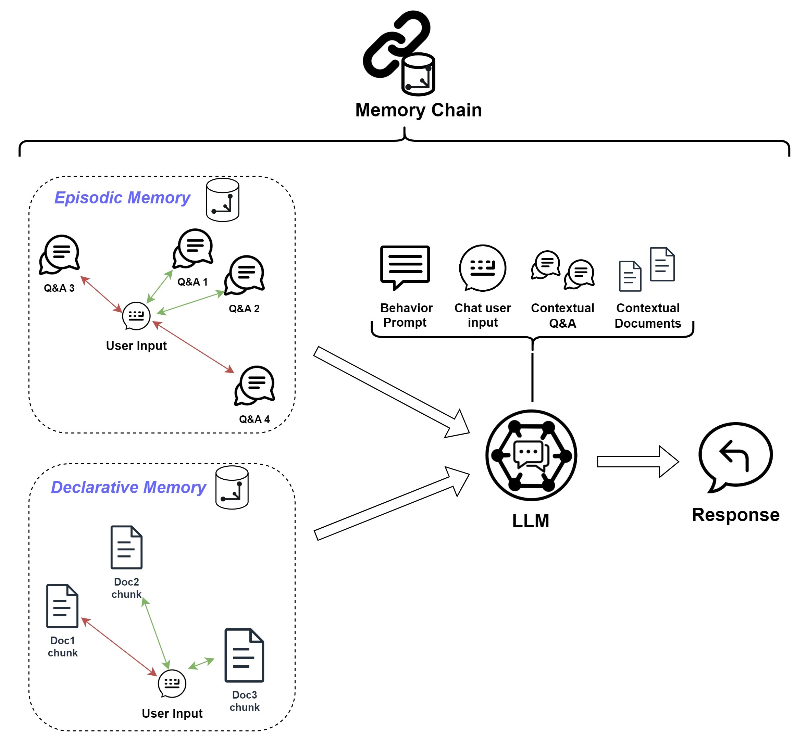

# Memory Chain

The Memory Chain is a simple chain that takes the user's input and the context retrieved from the episodic and declarative
[memories](../memory/long_term_memory.md) and formats them in the [main prompt](../prompts/main_prompt.md). Such prompt
is submitted to the language model.

{width=650px style="display: block; margin: 0 auto"}
