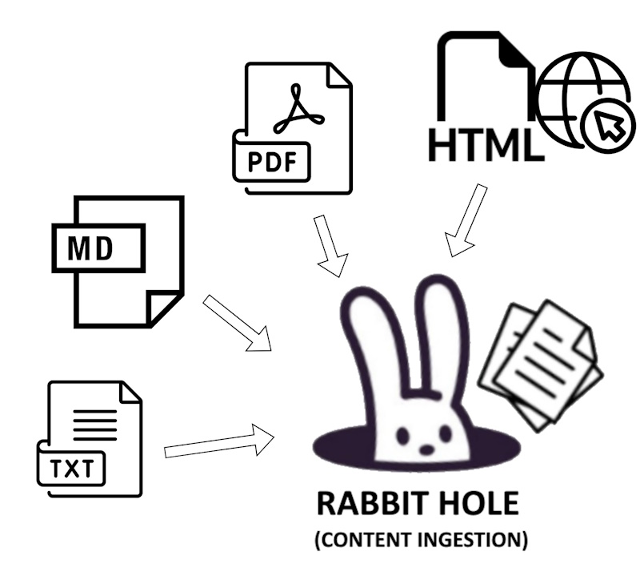

# Rabbit Hole

The Rabbit Hole is the Cat's component that takes care of ingesting documents and storing them in the [declarative memory](../memory/long_term_memory.md).
You can interact with it either through its [endpoint](../../technical/basics/basics.md), the [GUI](../../technical/basics/admin/admin-interface.md) or a Python script.

Currently supported file formats are: `.txt`, `.md`, `.pdf` or `.html` via web URL.

{width=400px style="display: block; margin: 0 auto"}