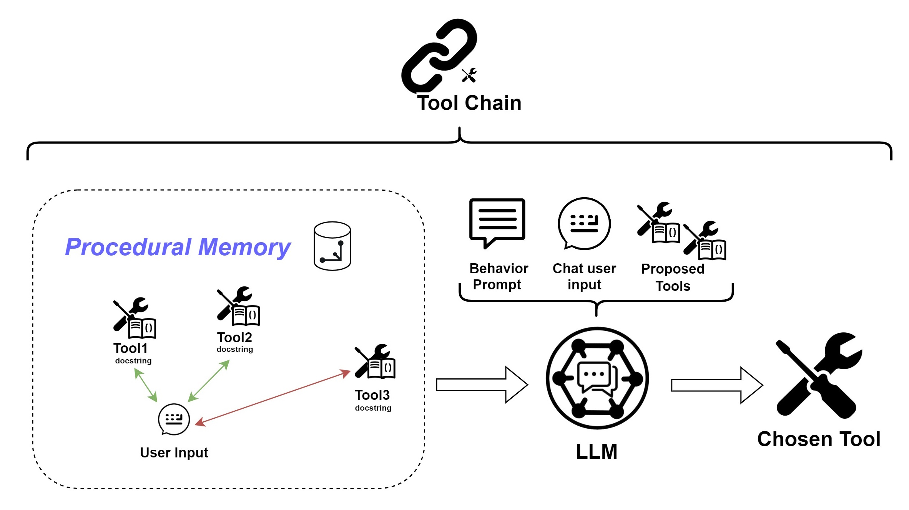

# Tool Chain

Sometimes a simple answer from the [language model](../llm.md#completion-model) is not enough.
For this reason, the Cat can exploit a set of custom tools (e.g. API calls and Python functions) coming from the [plugins](../plugins.md).  
The decision on *whether* and *which* action should be taken to fulfill the user's request is delegated to an Agent, i.e. the Tool Agent.

The Tool Agent uses the language model to outline a "reasoning" and accomplish the user's request with the tools retrieved
from the Cat's [procedural memory](../memory/long_term_memory.md).
The tools selection and usage is planned according to a set of [instructions](../prompts/main_prompt.md#instructions).
Finally, the Tool Agent parses the formatting of the tool output.

{width=650px style="display: block; margin: 0 auto"}
