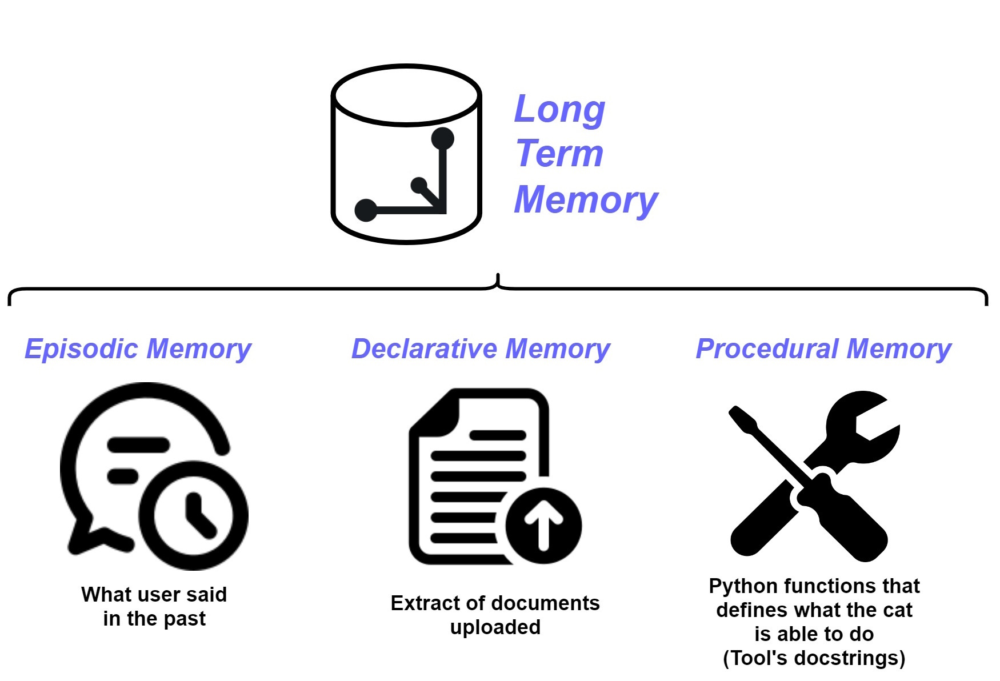

# Long Term Memory

The Cat has memory that persist across restarts, this memory is implemented using a [vector database](vector_memory.md).
The name of this memory is `Long Term Memory` (LTM), it is made of three components:

- [*Episodic Memory*](episodic_memory.md), contains an extract of things the user said in the past;
- [*Declarative Memory*](declarative_memory.md), contains an extract of documents uploaded to the Cat;
- [*Procedural Memory*](procedural_memory.md), contains the set of Python functions that defines what the Cat is able to do.

{width=450px style="display: block; margin: 0 auto"}

During conversation between the Cat and the user, the memories are accessed by the Cat to retrieve relevant context for passing to the LLM and are updated when the LLM responds (details of the read and write flow of the Long Term Memory can be found in this [diagram](../../../technical/flows/chatting-with-the-cat/)).

The retrieved relevant context is used to make up the [Main prompt](../prompts/main_prompt.md) and the Instruction prompt.

You can interact with the LTM using the [memory](../../technical/basics/admin/memory.md) page of the Admin Portal.
