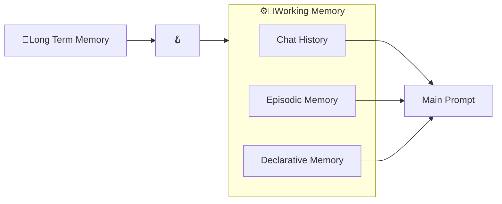

# Working Memory

The Working Memory is a handful component to store temporary data.  
For instance, it can be used to share data across plugins or, in general, across any function that get an instance of the Cat as an argument.

By default, the Working Memory stores the *chat history* that ends up in the [Main Prompt](../prompts/main_prompt.md).
Moreover, the Working Memory collects the relevant context that is fetched from the *episodic*, *declarative* and
*procedural* memories in the [Long Term Memory](long_term_memory.md).

Furthermore, the Cat embeds a simple user management system that allows to segregate contents bases on a `user_id`.  
More in details, multiple Working Memories can be stored in a component called [Working Memory List](https://cheshire-cat-ai.github.io/docs/technical/API_Documentation/memory/working_memory/#cat.memory.working_memory.WorkingMemoryList).  
By default, the Cat stores the content under the key `user`.

## Working Memory flow :material-information-outline:{ title="click on the nodes with hooks to see their documentation" }

!!! note "Developer documentation"
    [Long Term Memory hooks](../../technical/API_Documentation/mad_hatter/core_plugin/hooks/flow.md#at.mad_hatter.core_plugin.hooks.flow.after_cat_recalls_memories)

Nodes with the &#129693; point the execution places where there is an available [hook](../plugins.md) to customize the execution pipeline.
