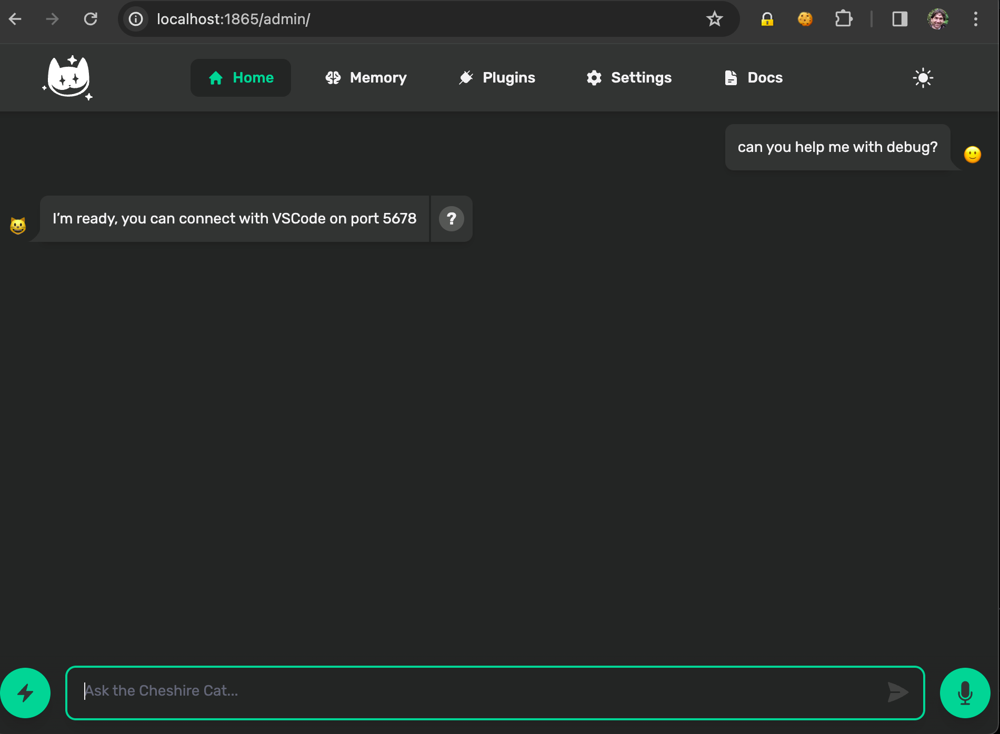
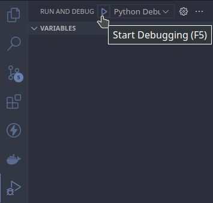

# &#128640; Debug with Visual Studio Code

The `Debug Server for VSCode` plugin helps you to debug the Cat with Visual Studio Code, install it from the [public plugins registry](../../quickstart/installing-plugin.md#manual-installation#Through-the-Admin-Dashboard) or [download the zip file](https://github.com/sambarza/cc-vscode-debugpy) (and follow the [Manual Instruction](../../quickstart/installing-plugin.md#manual-installation)).

## Add a new port to the container

After the installation, you will need to expose a new port to the container:

1. If you run the cat with `docker-compose`, expose the port by adding the following line under `ports` section:

    ```yml
        ports:
            - ${CORE_PORT:-1865}:80
            - 5678:5678           < --- add this line
    ```

2. If you run the cat with `docker run`, expose the port by using the `-p <host>:<container>` argument in the command like so:

    ```bash
        docker run --rm -it \ 
        -v ./data:/app/cat/data \ 
        -v ./plugins:/app/cat/plugins \ 
        -p 1865:80 \ 
        -p 5678:5678 \  < --- add this line
        ghcr.io/cheshire-cat-ai/core:latest
    ```

## Configure vscode

Once you have exposed the port, you will need to create a `launch.json` file having two different options:

   1. Use the `Run and Debug` tab to create it, selecting `Python Debugger` and then `Remote Attach` (Follow the prompts by answering with the default proposed).
   2. Create a folder in the root directory called `.vscode` and add the `launch.json` file into it.

            ├── <name of the root directory>
            │   ├── core
            │   ├── .vscode
            │   │   ├──launch.json

After the creation of the launch.json, Copy-Paste this config:

1. If you run using `docker-compose`:

    ```json
    {
        // Use IntelliSense to learn about possible attributes.
        // Hover to view descriptions of existing attributes.
        // For more information, visit: https://go.microsoft.com/fwlink/?linkid=830387
        "version": "0.2.0",
        "configurations": [
            {
                "name": "Python: Remote Attach to Cat",
                "type": "python",
                "request": "attach",
                "connect": {
                    "host": "localhost",
                    "port": 5678
                },
                "pathMappings": [
                    {
                        "localRoot": "${workspaceFolder}/core",
                        "remoteRoot": "/app"
                    }
                ],
                "justMyCode": true
            }
        ]
    }
    ```

2. If you run using `docker run`:

    ```json
    {
        // Use IntelliSense to learn about possible attributes.
        // Hover to view descriptions of existing attributes.
        // For more information, visit: https://go.microsoft.com/fwlink/?linkid=830387
        "version": "0.2.0",
        "configurations": [
            {
                "name": "Python: Remote Attach to Cat",
                "type": "python",
                "request": "attach",
                "connect": {
                    "host": "localhost",
                    "port": 5678
                },
                "pathMappings": [
                    {
                        "localRoot": "${workspaceFolder}/",
                        "remoteRoot": "/app/cat"
                    }
                ],
                "justMyCode": true
            }
        ]  
    }
    ```

## Connect vscode to the cat

To Connect the vscode debugger, ask the cat to help you on debugging  and in the `Run and Debug` tab start the debugging by clicking the `Play button` ▶️ or Use the shortcut `F5`.



You are ready to debug your plugin!

If you are new in VS code debugging, check the [official docs](https://code.visualstudio.com/Docs/editor/debugging).

## Troubleshooting

#### I click the button but then I don't see the debugging bar / the breakpoints are not respected

This usually means that the debugger is not active, make sure to activate the debugger by asking the Cat.

#### I cannot explore the code outside of my plugin

By default, you can only explore your "own" code but you can disable this by setting the param `justMyCode` to false in the `launch.json` file.

#### My Cat is installed in a remote server, can I debug it?

Of course you can! Just set the correct `host` and `port` in the `connect` param of the `launch.json` file.
