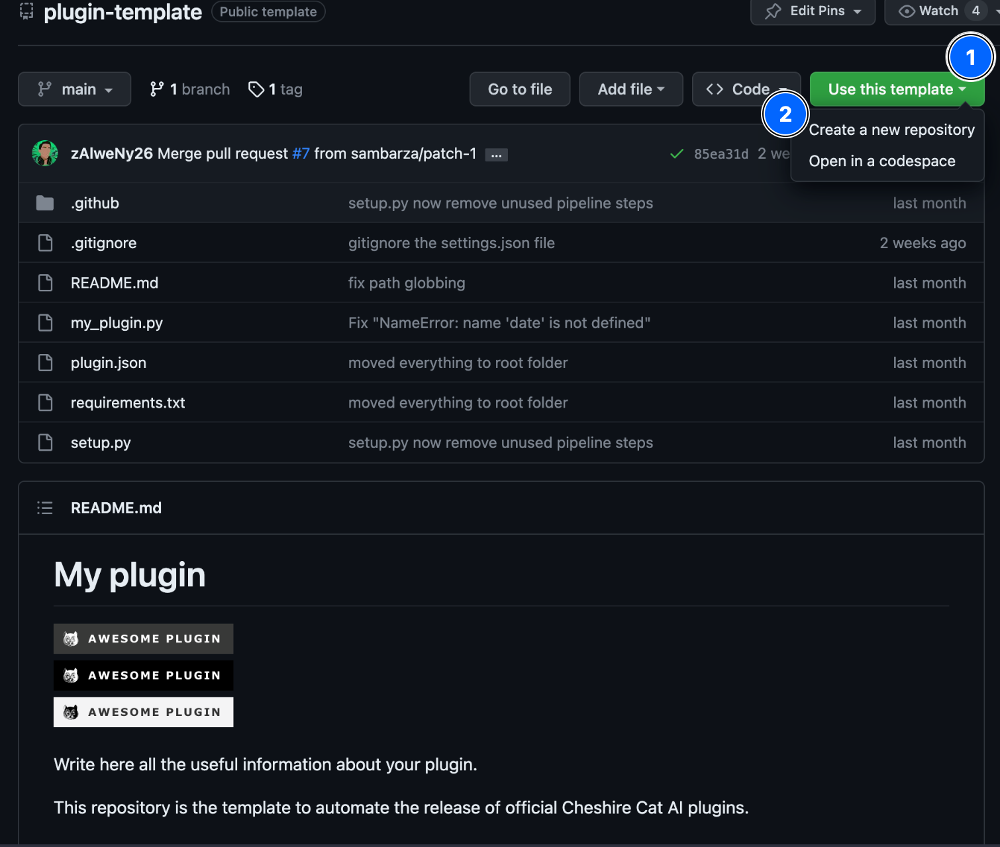
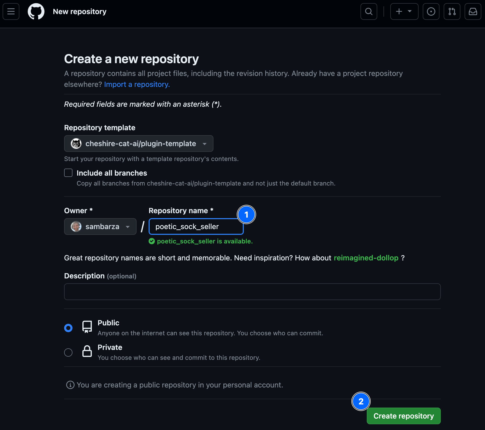
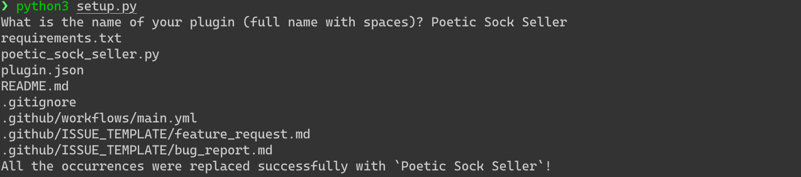

# &#128268; Using the Plugin Template

We have prepared a GitHub template for you to expedite the creation of a new plugin, ready for publication in the public Registry. The template includes a complete scaffolding for the plugin and the GitHub action configuration to release the plugin package.

## Creating the new plugin

In the example we will create a plugin for the Poetic Socks Seller (refer to the Quickstart section if you're not familiar with it). In the next steps, replace `poetic_sock_seller` with the name of you futuristic plugin!

Navigate to the [plugin-template](https://github.com/cheshire-cat-ai/plugin-template){:target="_blank"} GitHub repository, click on `Use this template` and, then, `Create a new repository`:



 as repository name and then click on `Create repository`:



## Cloning the Plugin

Now that you set up the remote repository on GitHub, you need to set up the code locally.
Hence, clone the repository directly in the Cat’s plugins folder on your machine:

``` shell
cd core/cat/plugins
git clone https://github.com/[your_account_name]/poetic_sock_seller.git
```

## Customizing the Plugin

Finally, run the setup.py script to customize the repository:

``` shell
cd poetic_sock_seller
python setup.py
```

The script will prompt you to write the name of your plugin, `Poetic Sock Seller`.
The output in the terminal should look like:
>

The template contains a source code example, look at it in the `poetic_sock_seller.py` file.

### &#128230; Release Creation

A repository created with our template automatically includes the creation of a release on GitHub through a GitHub action. This automation happens whenever you push changes to the `main` branch and the `version` number in the `plugin.json` file changes. The release is automatically tagged with the version number and released in all the formats supported by GitHub.

For details about the GitHub action, refer to the file `.github/workflows/main.yml`.
