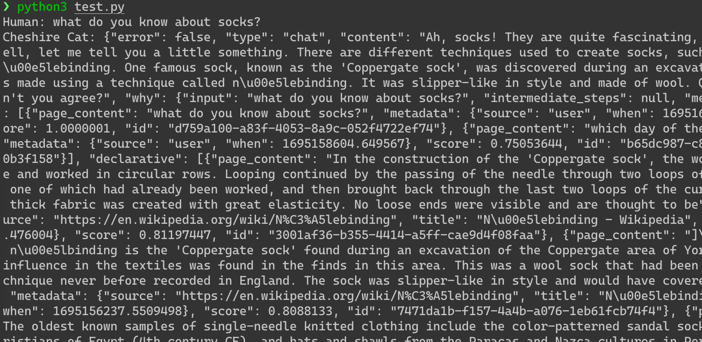

# Interact using API

The Cat is an API-first framework, you can chat with it using the WebSocket protocol.


Here is an example of how to use it, run it and ask "what do you know about socks?" again:

!!! example

    === "Python"
        ```python
        import asyncio
        import websockets
        import json

        async def cat_chat():

            # Creating a websocket connection
            async with websockets.connect('ws://localhost:1865/ws') as websocket:

                # Running a continuous loop until broken
                while True:

                    # Taking user input and sending it through the websocket
                    user_input = input("Human: ")
                    await websocket.send(json.dumps({"text": user_input}))

                    # Receiving and printing the cat's response
                    cat_response = await websocket.recv()
                    print("Cheshire Cat:", cat_response)

        # Running the function until completion
        asyncio.get_event_loop().run_until_complete(cat_chat())
        ```

The output in the terminal should looks like:



## Next Step
In the next step you will learn how load a text document in the documents memory.