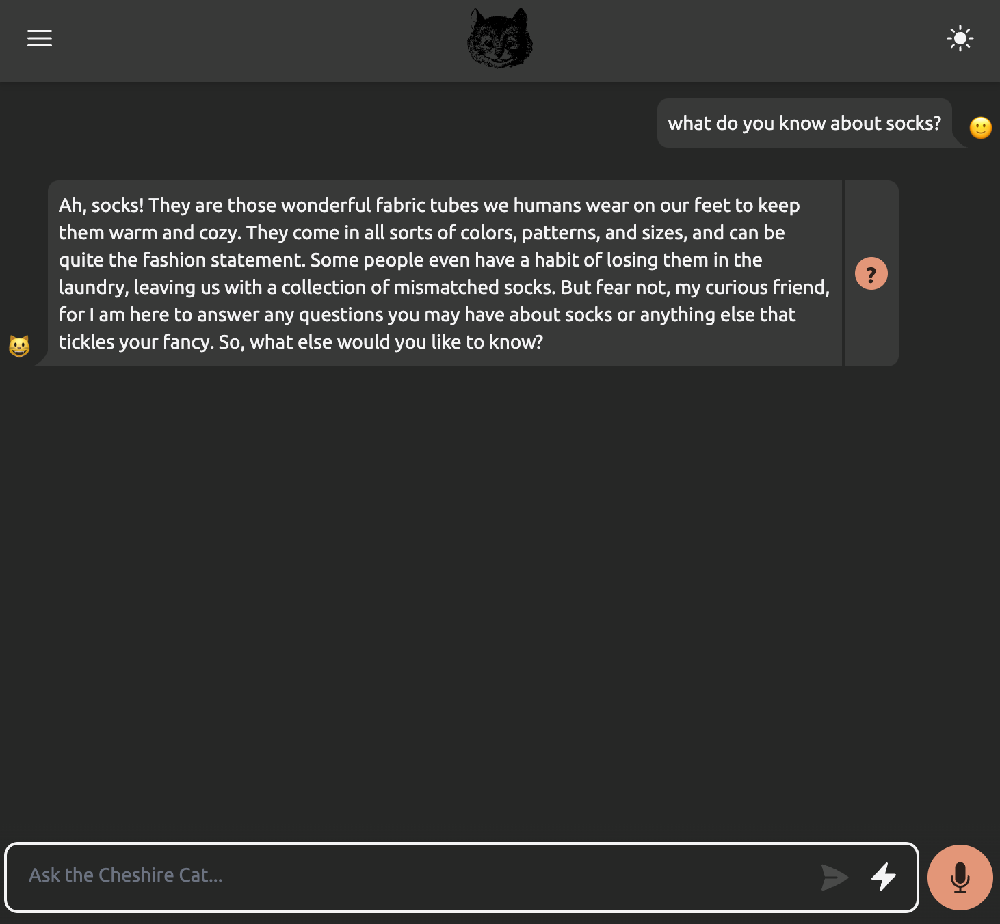

# Play with the Cat

## Requirements

Ensure that the Cat is installed and running, and the LLM is configured.

## Chatting with the Cat: the Admin Portal playground

The Cat is an API-first framework, and it doesn't provide a ready-to-use UI for the end user.
It is your responsibility to implement this UI.
However, the Cat offers a playground that you can use to quickly test the AI you are implementing.

To access playground, go to the Admin Portal at `localhost:1865/admin`, and click on the `Home` tab.
This tab serves as the playground for chatting with the Cat.

Try to ask something about socks, e.g. "what do you know about socks?".
The Cat will give a generic answer.
Afterward, we will expand this general knowledge with more specific information.

You have learned how to use the playground to test your AI via the Admin Portal.




## Chatting with the Cat: API interaction

The Cat is an API-first framework, you can chat with it using the WebSocket protocol.

Here is an example of how to use it:

```python
import asyncio
import websockets
import json


async def cat_chat():
    # Creating a websocket connection
    async with websockets.connect("ws://localhost:1865/ws") as websocket:
        # Taking user input and sending it through the websocket
        user_input = input("Human: ")
        await websocket.send(json.dumps(
            {
                "text": user_input
            }
        ))

        # Receiving and printing the cat's response
        cat_response = json.loads(await websocket.recv())

        print("Cheshire Cat:", json.dumps(cat_response, indent=4))


# Running the function until completion
asyncio.get_event_loop().run_until_complete(cat_chat())
```

Run it and ask `what do you know about socks?` again, the output in the terminal should looks like:

```bash
❯ python3 test.py
Human: what do you know about socks?
Cheshire Cat: {
    "error": false,
    "type": "chat",
    "content": "Ah, socks! They're quite fascinating little things, aren't they? Well, let me tell you what I know about socks. They come in all shapes, sizes, and colors, and they're usually worn on the feet to keep them warm and cozy. Some people like their socks plain and simple, while others prefer them with funky patterns or cute designs. Socks can be made from different materials like cotton, wool, or even synthetic fibers. They can also have different lengths, from ankle socks to knee-highs. And let's not forget about those toe socks that give each little piggy its own little cozy home! So, there you have it, a little glimpse into the world of socks. Is there anything specific you'd like to know about them?",
    "why": {
        "input": "what do you know about socks?",
        "intermediate_steps": null,
        "memory": {
            "episodic": [],
            "declarative": [],
            "procedural": []
        }
    }
}
```

This example explains the **Raw** use of the Cat APIs, however there are convinient and ready-made libraries available for various languages!

#### More Info

[`Developers -> Client Libraries`](../production/clients.md)
