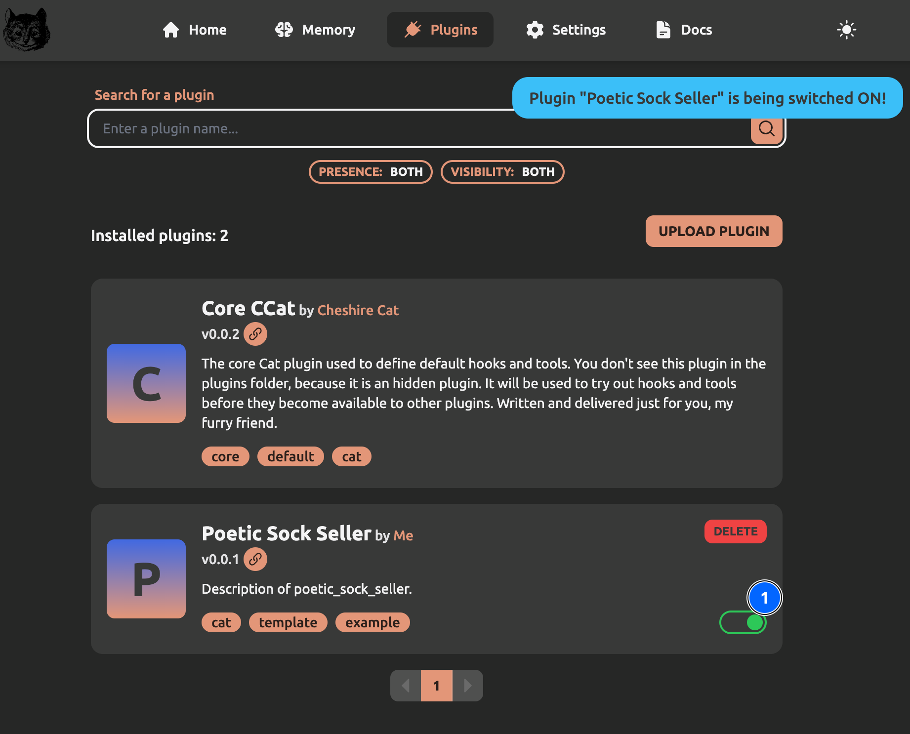

# &#128268; Preparing a Plugin

Plugins are packages of `Tools` and `Hooks`.
You don't distribute a `Tool` or a `Hook` directly, you will distribute a Plugin containing them.

## Creating the Plugin
In this step, we will prepare an empty plugin and in the next steps we will insert a `Tool` and a `Hook` inside it.


To create a plugin just create a new folder in `core/cat/plugins/`, for our first plugin the folder name will be `poetic_sock_seller`.

You need two files to your plugin folder:

    ├── core
    │   ├── cat
    │   │   ├── plugins
    |   |   |   ├── poetic_sock_seller
    |   |   |   |   ├ poetic_sock_seller.py
    |   |   |   |   ├ plugin.json

The `plugin.json` file contains plugin's title and description, and is useful in the Admin Portal to recognize the plugin and activate/deactivate it.

`plugin.json` example:

```json
{
    "name": "Poetic Sock Seller",
    "description": "Description of poetic_sock_seller"
}
```

The `poetic_sock_seller.py` file will contain `Tools` and `Hooks` source code and can be left completely empty for this step.

## Activating the Plugin
Now, go to the `Plugin` tab of the Admin Portal.
Your empty plugin will be there, activate it:



#### More Info
[Developers → Plugins Reference → Plugin](../technical/plugins/plugins.md)

## Next Step
In the [next step](./writing-tool.md), you will learn how to create your first `Tool`.