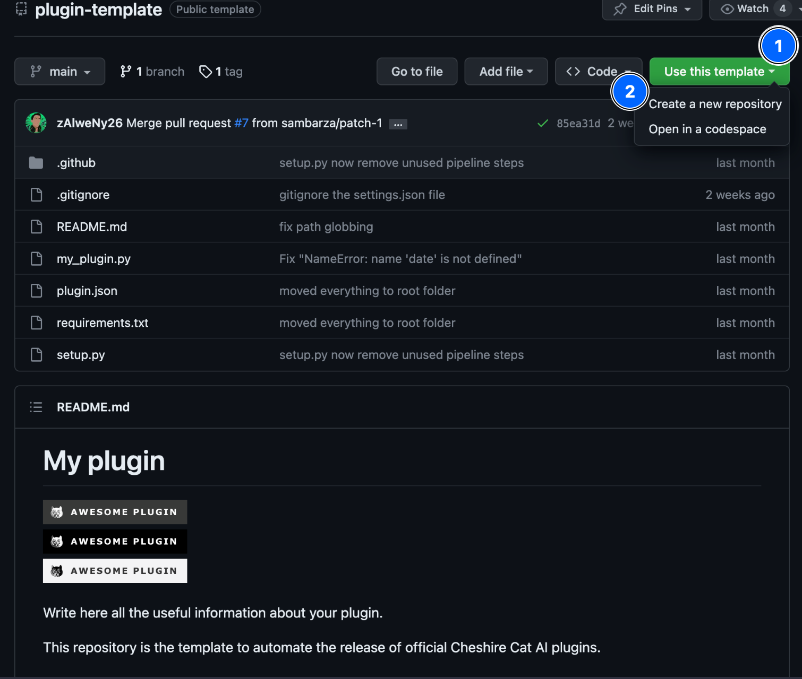
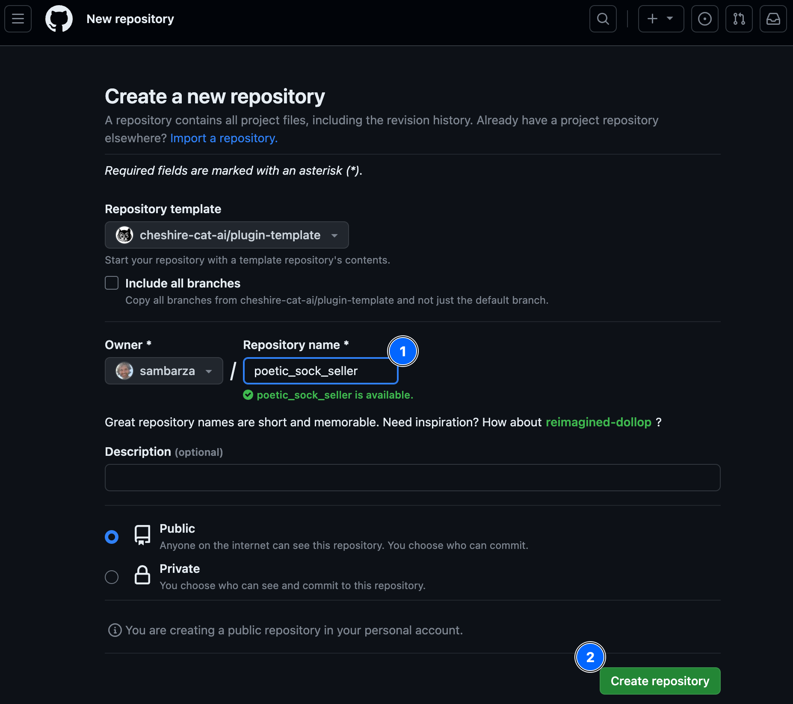
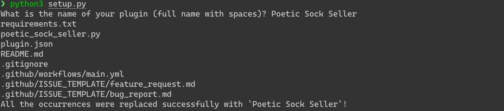

# Prepare a Plugin

Plugins are packages of `Tools` and `Hooks`, you don't distribute a `Tool` or a `Hook` directly, you will distribute a Plugin containing them.

In this step we will use a GitHub template to prepare an empty Plugin and in the next steps we will insert a `Tool` and a `Hook` inside.

Navigate to the [plugin-template](https://github.com/cheshire-cat-ai/plugin-template){:target="_blank"} GitHub repository, click on `Use this template` and then `Create a new repository`:



Choose `poetic_sock_seller` as repository name and then click on `Create repository`:



Now that you set up the remote repository on GitHub, you need to set up the code locally. Hence, clone the repository directly in the Cat’s plugins folder on your machine:

``` shell
cd core/cat/plugins
git clone https://github.com/[your_account_name]/poetic_sock_seller.git
```

Finally, run the setup.py script to customize the repository:
``` shell
cd poetic_sock_seller
python setup.py
```

The script will prompt you to write the name of your plugin, `Poetic Sock Seller`, the output in the terminal should looks like:
>

The template contains a source code example that we don't need, remove all the code inside the the file `poetic_sock_seller.py`

Now got to the `Plugin` tab of the Admin Portal, your empty plugin will be there:


## Next Step
In the next step you will learn how to create your first `Tool`