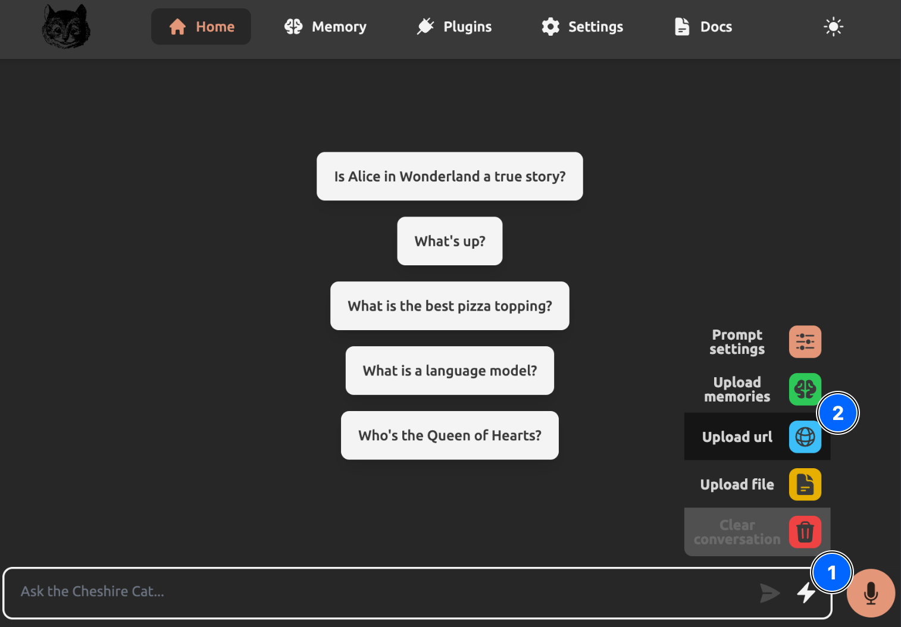
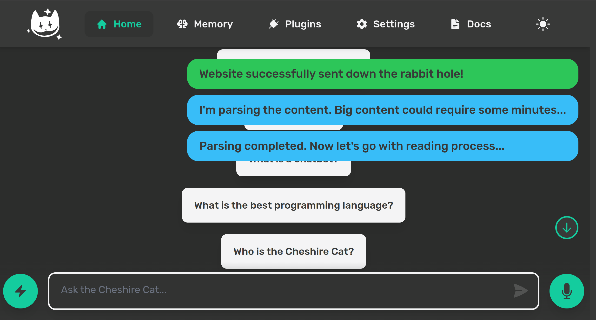
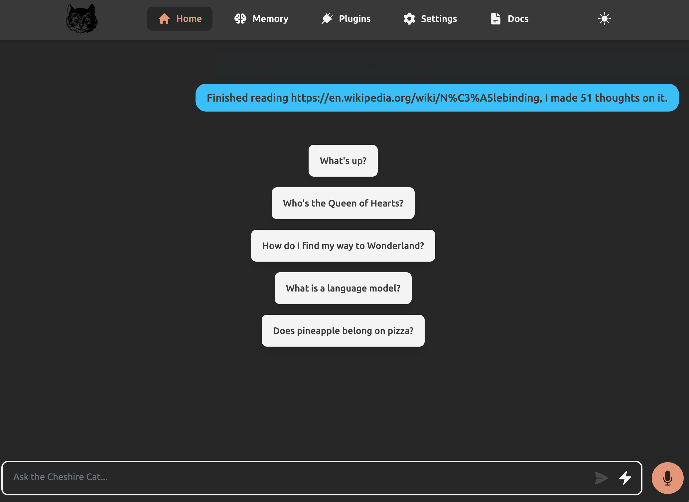
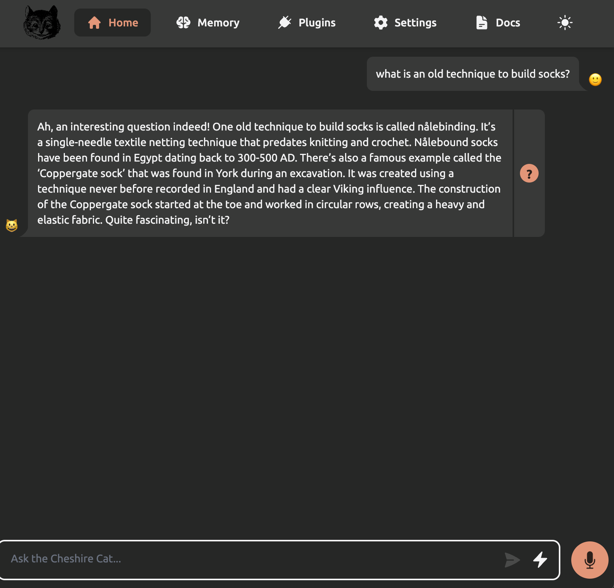
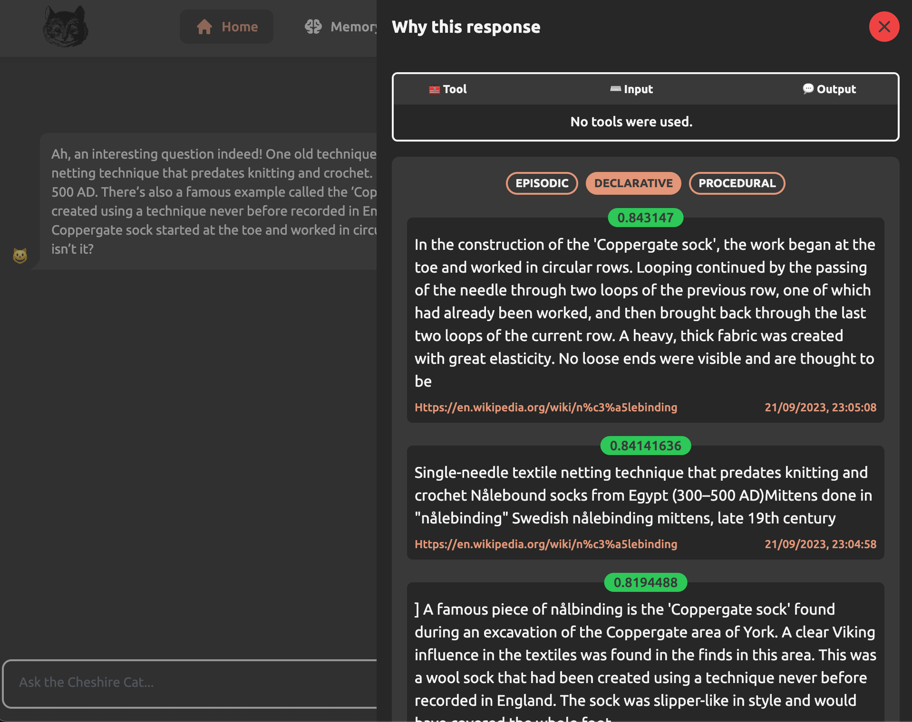

# Upload a Document

Documents can be uploaded via the Admin Portal (and it's also using APIs).
The Cat will consider uploaded documents to generate the answer to your question.
These documents are saved in a local database called `declarative memory`.

## Improve the Cat knowledge
The Cat's knowledge about socks is quite basic; we will upload more specific knowledge.

Go to the Admin Portal at `localhost:1865/admin` on the `Home` tab, click on the `Flash Icon`, then click on `Upload url` and use this url `https://en.wikipedia.org/wiki/N%C3%A5lebinding`:

You receive a notification of the ingesting operation:

You receive notification of the finished read:

## Trying new knowledge
The Cat can answer with more detailed answers:

## Why the response?
By clicking on the question mark next to the answer, you can understand what prompted the Cat to provide the response.
In this case, you can see that it used the knowledge coming from the documents (`declarative memory`):

## Next Step
In the [next step](./installing-plugin.md), you will learn what a plugin is and how to install it.