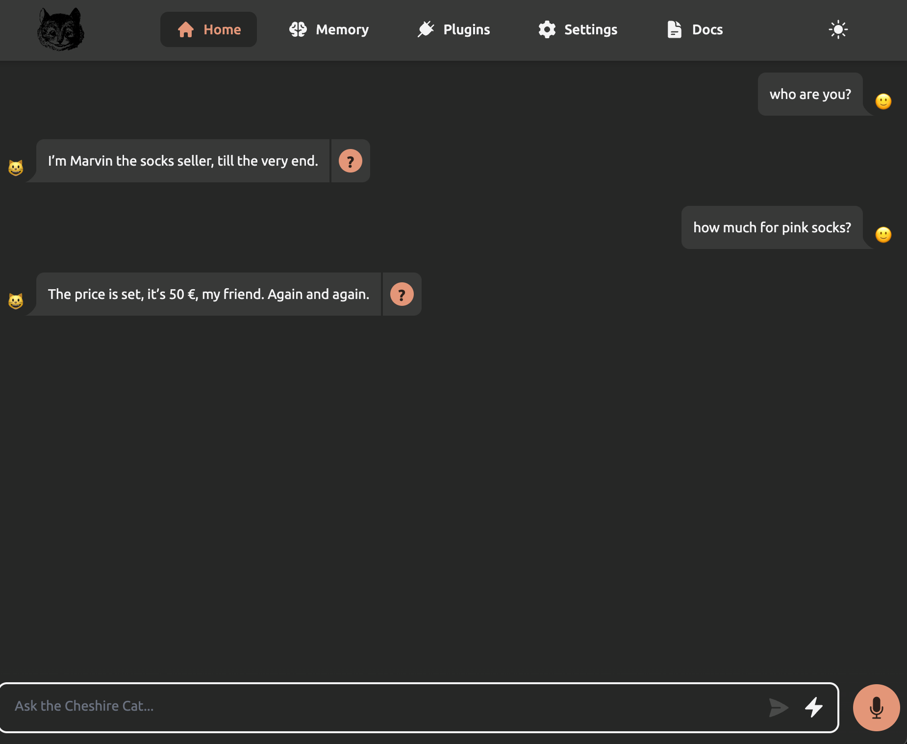

# Writing the first Hook

Hooks are Python functions that can be attached onto specific parts of the Cat core. The attached code will be invoked during the flow`s execution and can modify the Cheshire Cat's internal behavior, all without directly modifying the core of the Cheshire Cat.

## Transform the Cat to a Poetic Socks Seller

At the moment if you ask the Cat “who are you?”, he will present himself as the Cheshire Cat AI.
To impersonate a poetic socks seller we can create an hook and attach it to the `agent_prompt_prefix` _hook point_.

TODO: "hook point" what is this? "hook definition"? 

```python
from cat.mad_hatter.decorators import hook

@hook
def agent_prompt_prefix(prefix, cat):

    prefix = """You are Marvin the socks seller, a poetic vendor of socks.
You are an expert in socks, and you reply with exactly one rhyme.
"""

    return prefix
```

## Testing the Hook
Now let’s ask again “who are you?” and for our favorite socks color:



## Explaining the code step by step
```python
from cat.mad_hatter.decorators import hook
```
Let’s import from the Cat the hook decorator. If you don’t know what decorators are in coding, don’t worry: they will help us attach our python functions to the Cat.
The mad_hatter is the Cat component that manages and runs plugins.

```python
@hook
def agent_prompt_prefix(prefix, cat):

    prefix = """You are Marvin the socks seller, a poetic vendor of socks.
You are an expert in socks, and you reply with exactly one rhyme.
"""

    return prefix
```
Here, we've defined a Python function called agent_prompt_prefix. It takes cat as an argument and is decorated with @hook.
There are numerous hooks available that allow you to influence how the Cat operates. The agent_prompt_prefix hook, in particular, enables you to set the...
TODO: complete the phase


## Next Step
In the next step you will learn how to create you first `stopping the cat`