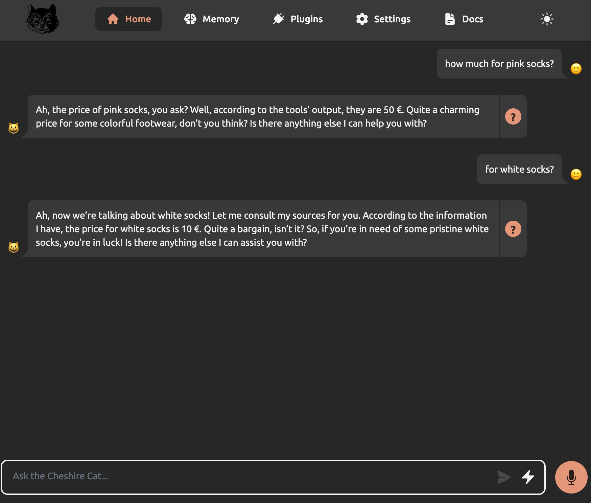
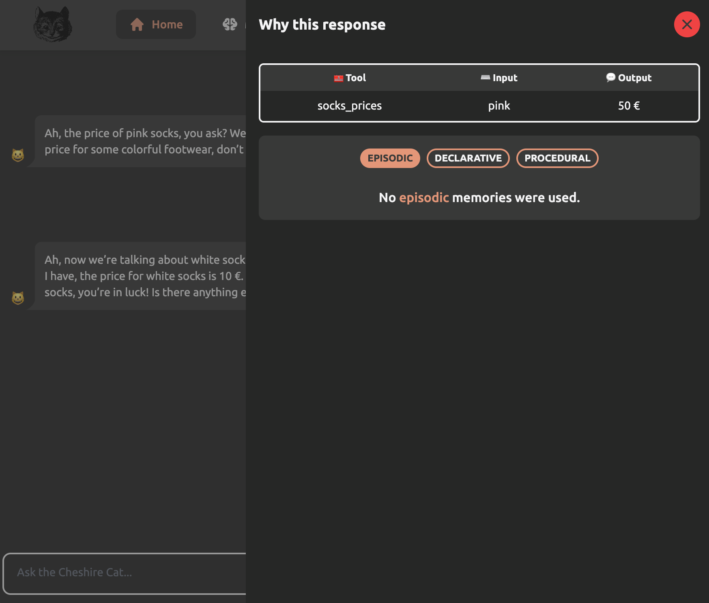

# Writing the first Tool

Tools are Python functions called by the LLM to execute actions.
They are made of two parts: the first one contains instructions that explain the LLM when and how to call function;
the second one contains the actual code to execute.

## Creating the Tool

Now, let’s get down to business.
A real socks sales representative offers a quantity of socks, with many colors and corresponding price.
Let’s say a customer wants to know the price for socks of a specific color.
We could write a tool to answer the question.
Therefore, copy and past this source code inside the file `poetic_sock_seller.py`:

```python
from cat.mad_hatter.decorators import tool

@tool
def socks_prices(color, cat):
    """How much do socks cost? Input is the sock color."""
    prices = {
        "black": 5,
        "white": 10,
        "pink": 50,
    }
    if color not in prices.keys():
        return f"No {color} socks"
    else:
        return f"{prices[color]} €" 
```

## Testing the Tool

Now, let’s ask for our favorite socks color:



## Why the response?

By clicking on the question mark next to the answer, you can understand what prompted the Cat to provide the response.
In this case, you can see that our tool "socks_prices" was used:



## Explaining the code step by step

```python
from cat.mad_hatter.decorators import tool
```

Let’s import the tool decorator from the Cat.
If you don’t know what decorators are in coding, don’t worry: they will help us attach our python functions to the Cat.
The `mad_hatter` is the Cat component that manages and runs plugins.

```python
@tool
def socks_prices(color, cat):
    """How much do socks cost? Input is the sock color."""
```

We define a function called "socks_prices," which takes as input the color of the desired socks and a cat instance.

The `@tool()` decorator has the main function of letting the Cat know that the following function is a tool.

The docstring just after the function signature reads as follows:

>"How much do socks cost? Input is the sock color."

This description instructs the LLM on when to call this tool and describes what input to provide.

Going back to the tool actual code:

```python
    prices = {
        "black": 5,
        "white": 10,
        "pink": 50,
    }

    if color not in prices.keys():
        return f"No {color} socks"
    else:
        return f"{prices[color]} €" 
```

Not much to say here: we just check if the color is present in the dictionary and output the price.
What is indeed interesting is that, in a tool, you can connect your AI to any service, database, file, device, or whatever you need.
Imagine turning on and off the light in your room, searching an e-commerce or writing an email.
The only limit is your fantasy &#128512;.

## WatchFiles detected changes... reloading

When changes to the plugin's source code are detected, the Cat automatically restarts.
Feel free to make changes within the code and observe the results.

#### More Info

Tools reference: [Plugins → Tools](../plugins/tools.md)

Sometimes debugging can be necessary, please refer to the [`Plugins → Debugging`](../plugins/debugging/vscode.md) section for more information.

## Next Step

In the [next step](./writing-hook.md), you will learn how to create your first `Hook`.
