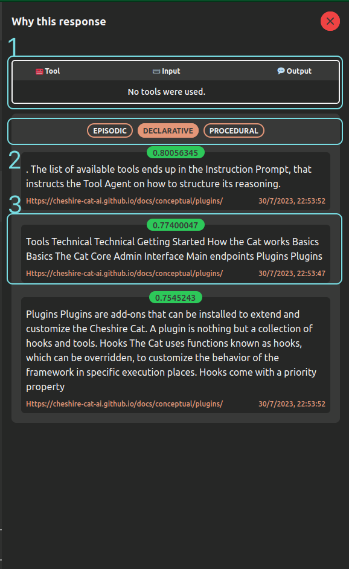

# &#129526; The Admin Interface

The frontend interface of The Cheshire Cat can be accessed via `localhost:1865/admin`.
This interface provides users with an easy-to-use chat that acts as a playground and can be used to interact with your application.
The Cat core uses a static build of the admin, source code can be found [here](https://github.com/cheshire-cat-ai/admin-vue).

All the cat's settings are available under this GUI's `Settings` menu.

# Home

This is the home page of the Admin interface, where it is possible to chat with the Cat.

1. User's message: this is the message sent by the user
2. Cat's answer: this is the answer sent by the Cat
3. Why button: this button opens the [*Why*](#why-this-response) side panel that explains why the Cat answered in a certain way
4. Send button: this button allows sending the message
5. Flash button: this button opens a [small panel](#flash-button) with additional features
6. Theme button: this button toggles the light/dark modes

## Why this response

This panel contains some useful information to understand why the Cat answered the way it answered.

    

1. Tool table: this table reports the intermediate steps of a tool usage. For each, it provides the name of the tool,
the input given to the tool function and the related output
2. Memory buttons: these buttons allow switching the memory showing below the retrieved context from the memory at hand
3. Retrieved memories: these bubbles show the memory the Cat used as a context. In green there is the similarity score with the input message,
at the bottom left the source of the memory and on the bottom right the upload time.

## Flash button
