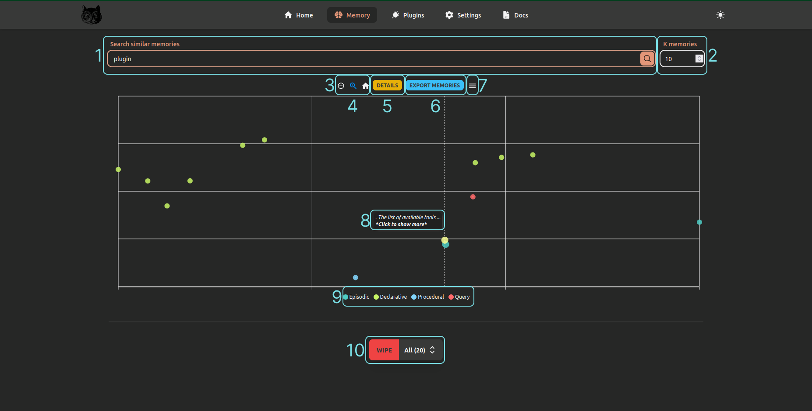
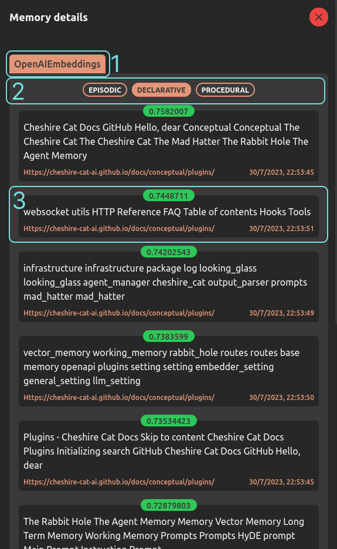
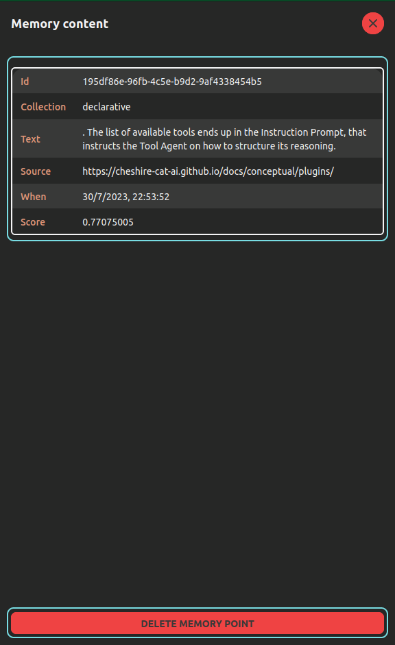

# Memory

The Memory page allows interacting with the Cat's [long term memory](../../../conceptual/memory/long_term_memory.md).
Specifically, it is possible to query the vector collections and retrieve a custom number of similar memories,
wipe the collections or delete individual memories.

To plot the memories, the Cat uses an algorithm called t-distributed Stochastic Neighbor Embedding (t-SNE)[^1].
This is a dimensionality reduction algorithm commonly used to visualize high-dimensional points.
In short,
t-SNE embeds the memory points projecting them on a 2D plane such that similar points live close to each other.
Namely, the most similar memories to the query are the closest points to the red one.  
Reducing the dimensionality of memories is necessary
since memories are stored in the [vector memory](../../../conceptual/memory/vector_memory.md) collections
in the form of multidimensional [points](../../../conceptual/memory/vector_memory.md)
(e.g. points with 1536 dimensions) and for this reason cannot be plotted.

1. **Search bar**: allows writing a text query used to search for similar documents in memory.
2. **K memories**: allows defining how many memories to retrieve.
3. **Plot buttons**: allow zooming or restoring the view of the plot.
4. **Details**: opens a [side panel](#details-button) with the list of all retrieved memories for each collection (i.e. episodic, declarative and procedural).
5. **Export memories**: this button allows exporting all the plotted memories in a JSON file.
This allows saving memories on disk and sharing them with other users.
The memory file can be uploaded again with the ["Upload memory"](admin-interface.md#flash-button) button.
6. **Save plot**: this button allows saving the plot in `.png` or `.svg` formats.
7. **Memory tooltip**: this tooltip shows when hovering the mouse on the memory points.
Clicking on it opens a [side panel](#show-more-button) with detailed information about the point at hand.
8. **Memories toggle**: these buttons allow turning on/off specific memories in the plot.
9. **Wipe**: this button allows wiping out (i.e. delete permanently) the individual memories or all of them.

## "Details" button

<figure markdown>
  { width="300" }
</figure>

1. **Embedder**: this tab tells what's the [embedder](../../../conceptual/llm.md#embedding-model) in use.
2. **Memory buttons**: these buttons allow switching between the lists of every memory collection.
3. **Memory item**: these elements give information about every the retrieved memories.
In green there is the similarity score with the query; below the memory content;
   on the bottom right there is the source of the memory and on the bottom left the upload time.

## "Show more" button

<figure markdown>
  { width="300" }
</figure>

1. **Memory content**: detailed information about the memory point.
2. **Delete memory**: this button allows deleting the point from the memory collection.

## References

[^1]: Van der Maaten, L., & Hinton, G. (2008). Visualizing data using t-SNE. Journal of machine learning research, 9(11).

