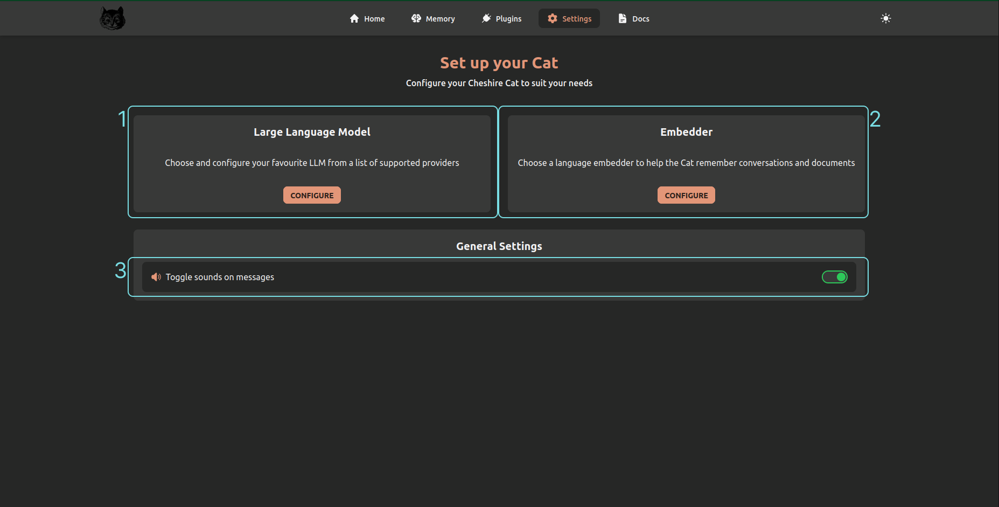

# Settings

The settings page allows managing the settings of the [language models](../../../conceptual/llm.md) and other general settings.

1. **Large Language Model** (LLM): the *configure* button opens the side panel to configure your preferred LLM.
One LLM should always be configured otherwise it is not possible to chat.
2. **Embedder**: the *configure* button opens the side panel to configure your preferred LLM.
By default, the Cat sets the embedder having the same vendor of the LLM you configured.
When this is not available, the Cat uses an embedder that generate random numbers to embed the text.
3. **Toggle sound**: the toggle allows turning on/off the sound when the Cat sends a message.