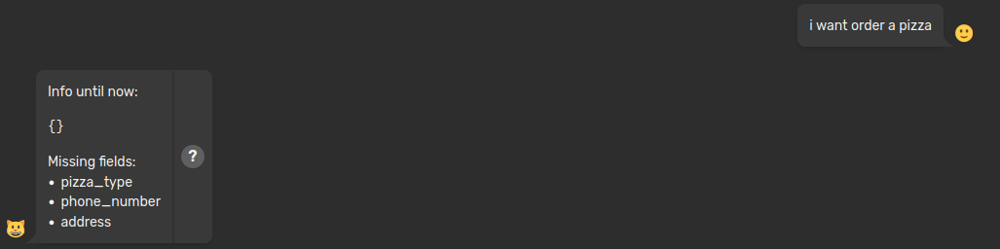
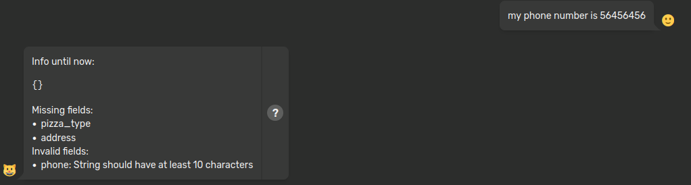

# 📋 Forms

Forms are Particular Tools useful for collecting user information during a conversation!


## How the Forms work

Imagine a scenario where you need to create an Order system for a pizzeria, using only the conversation with the user. The user must provide three pieces of information:

1. Type of pizza: must be a string from a predifined set.
2. Phone number: must be 10 digits long and follow a specific dialing code.
3. Address: must be a valid address in "Milano".

How can we resolve this problem? Well, these types of information are **very specific** and they need:

- [**Validators:**](https://docs.pydantic.dev/latest/concepts/validators/#field-validators) We need validators to ensure the data is correct (e.g., phone numbers can vary by country, the pizzeria has a specific menu of pizzas, and delivery is restricted to certain areas of the city).
- **Flexible Sequence**: The information can be provided in any order during the conversation (e.g., a user might give the address before mentioning the type of pizza).

This is where Forms come in handy!

## Implementation

```python

class PizzaOrder(BaseModel): #(1)
    pizza_type: str
    phone: str
    address: str


@form #(2)
class PizzaForm(CatForm): #(3)
    description = "Pizza Order" #(4)
    model_class = PizzaOrder #(5)
    start_examples = [ #(6)
        "order a pizza!",
        "I want pizza"
    ]
    stop_examples = [ #(7)
        "stop pizza order",
        "not hungry anymore",
    ]
    ask_confirm = True #(8)

    def submit(self, form_data): #(9)

        # Fake API call to order the pizza
        response = requests.post(
            "https://fakecallpizza/order",
            json={
                "pizza_type": form_data["pizza_type"],
                "phone": form_data["phone"],
                "address": form_data["address"]
            }
        )
        response.raise_for_status()
        
        time = response.json()["estimated_time"]

        # Return a message to the conversation with the order details and estimated time
        return {
            "output": f"Pizza order on its way: {form_data}. Estimated time: {time}"
        }

```

1. Pydantic class representing the information you need to retrieve.
2. Every class decorated with `@forms` is a Form.
3. Every Form must inherit from `CatForm`.
4. Description of the Form. <!-- , useful to the [tool chain](/conceptual/cheshire_cat/tool_chain/). Is necessary, as it will show up in the Tool chain prompt. It should describe what the form is useful for, so the LLM can select the tool and input it properly. -->
5. Pydantic class name.
6. Every Form must include a list of *start examples* to help the LLM identify and initiate the form correctly. This is similar to the principle of a tool's docstring.
7. Every Form must include a list of *stop examples* to help the LLM know when to terminate the form during the conversation.
8. A Form can request user confirmation for the data provided.
9. Every Form must override this method to define its functionality, such as calling a database to collect information, using an Order API, interacting with another agent or LLM, etc.

## Changing the "actions" of the Form

Forms are implemented as [FSM](https://en.wikipedia.org/wiki/Finite-state_machine) and you can modify any transition of the FSM by overriding the methods.

Here the diagram of the FSM:
TODO

### State-transition function

Each FSM has a State-Transition function that describes what is the next action to perform based on the given input. In the case of a Form's implementation, the input is the **User prompt** and the `def next(self)` method acts as the State-Transition function.

The form evaluates four states:

1. INCOMPLETE
2. WAIT_CONFIRM
3. CLOSED
4. COMPLETE

Each state executes one or more phases:

- User Stop Form Phase
- User Confirmation Phase
- Updating Phase
- Visualization Phase
- Submit Phase

You can modify this state-transition by overriding the `def next(self)` method and accessing the state via `self._state`. The states are values from the `CatFormState` enum.

### User Stop Form Phase

The User Stop Form Phase is where the Form checks whether the user wants to exit the form. You can modify this phase by overriding the `def check_exit_intent(self)` method.

### User Confirmation Phase

The User Confirmation Phase is where the Form asks for confirmation of the information provided by the user if `ask_confirm` is set to true. You can modify this phase by overriding the `def confirm(self)` method.

### Updating Phase

The Updating Phase is where the Form performs the Extraction Phase, Sanitization Phase and Validation Phase. You can modify this phase by overriding the `def update(self)` method.

#### Extraction Phase

The Extraction Phase is where the Form extracts all possibile information from the user's prompt. You can modify this phase by overriding the `def extract(self)` method.

#### Sanitization Phase

The Sanitization Phase is where the information is sanitized to remove unwanted values (null, None, '', ' ', etc...). You can modify this phase by overriding the `def sanitize(self, model)`method.

#### Validation Phase

The Validation Phase is where the Form attempts to construct the model, allowing Pydantic to use the implemented validators and check each field. You can modify this phase by overriding the `def valdiate(self, model)` method.

### Visualization Phase

The Visualization Phase is where the Form displays a message to the user, showing the model's status.

By default the cat displays the forms like so 

When there is invalid info retrieved from the conversation, the Cat specifies the issue 

You can modify this phase by overriding the `def message(self)` method:

```python
    # In the form you define 
    def message(self): #(1) 
        if self._state == CatFormState.CLOSED: #(2)
            return {
                "output": f"Form {type(self).__name__} closed"
            }
        missing_fields: List[str] = self._missing_fields #(3)
        errors: List[str] = self._errors #(4)
        out: str = f"""
        The missing informations are: {missing_fields}.
        These are the invalid ones: {errors}
        """
        if self._state == CatFormState.WAIT_CONFIRM:
            out += "\n --> Confirm? Yes or no?"

        return {
            "output": out
        }

```

1. This method is useful for changing the Form visualization.
2. Forms have states that can be checked.
3. Forms can access the list of the missing fields.
4. Forms can access the list of the invalid fields and the related errors.

### Final Phase: Submit

The Submit Phase is where the Form concludes the process by executing all defined instructions with the information gathered from the user's conversation.
The method has two parameters:

- **self**: Provides access  to information about the form and the `StrayCat` instance.
- **form_data**: The defined Pydantic model formatted as a Python dictionary.

The method must return a dictionary where the value of the `output` key is a string that will be displayed in the chat.

If you need to use the Form in future conversations, you can retrieve the model from the working memory by accessing the key `form`.

Below is an example:

```python
    @hook  
    def before_cat_sends_message(message, cat):
        form_data = cat.working_memory["form"]
```
