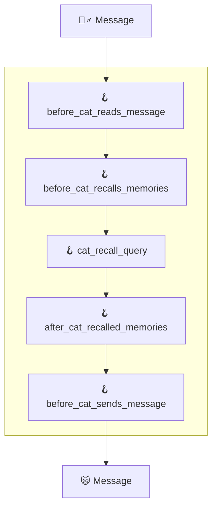

# &#129693; Hooks

Hooks are python functions that are called directly from the Cat at runtime.  
They allow you to change how the Cat does things by changing prompt, memory, endpoints and much more.

Both Hooks and Tools are python functions, but they have strong differences:

|                    | Hook                                                    | Tool                                                   |
|--------------------|:--------------------------------------------------------|:--------------------------------------------|
| Who invokes it     | The Cat                                                 | The LLM                                     |
| What it does       | Changes flow of execution and how data is passed around | Is just a way to let the LLM use functions  |
| Decorator          | `@hook`                                                 | `@tool`                                     |

## Available Hooks

The positions of the available hooks are indicated in the process diagrams found under the menu `How the Cat works`, but not all of the hooks have been documented yet. ( [help needed! &#128568;](https://discord.com/channels/1092359754917089350/1092360068269359206){:target="_blank"} ).

At the moment you can hack around by exploring the available hooks in `core/cat/mad_hatter/core_plugin/hooks/`.
All the hooks you find in there define default Cat's behaviour and are ready to be overridden by your plugins.

## Hooks used to generate a response
When the cat receives a message, the \_\_call\_\_ method of the main class is called. To produce a response a process is started in which several hooks are available to modify the cat's behaviour, let's see what they are:

Each of these hooks can be modified to completely change the behaviour of the cat in different situations. For example, through _before_cat_recalls_memories_ it is possible to change the number of memories the cat will use to produce a response.

## Examples

  1. How to change the prompt
  2. How to change how memories are saved and recalled
  3. How to access and use the working memory to share data around

## Hook search

TODO
