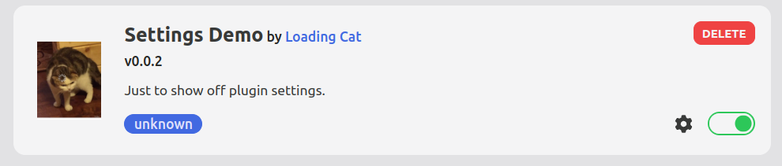
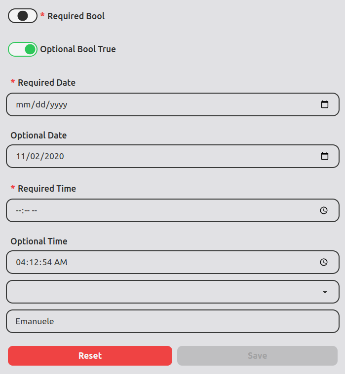

# &#127898; Plugin Settings

Your plugin may need a set of options, to make it more flexible and customizable.  
It is possible to easily define settings for your plugin, so the Cat can show them in the admin interface.

## Settings schema

With the `plugin_settings_schema` hook you can tell the Cat how your settings are named, what is their type and (if any) their default values.  
The hook must return a [JSON Schema](https://json-schema.org/) for the settings. You can code the schema manually, load it from disk, or (recommended) obtain it from a [pydantic](https://docs.pydantic.dev/latest/usage/json_schema/) class.
Here is an example with all supported types, with and without a default value:

```python
from pydantic import BaseModel
from enum import Enum
from datetime import date, time
from cat.mad_hatter.decorators import hook


# select box
#   (will be used in class DemoSettings below to give a multiple choice setting)
class NameSelect(Enum):
        a: str = 'Nicola'
        b: str = 'Emanuele'
        c: str = 'Daniele'


# settings
class DemoSettings(BaseModel):

        # Integer
        #   required setting
        required_int: int
        #   optional setting, with default value
        optional_int: int = 42

        # Float
        required_float: float
        optional_float: float = 12.95
        
        # String
        required_str: str
        optional_str: str = "stocats"
        
        # Boolean
        required_bool: bool
        optional_bool_true: bool = True
        
        # Date
        required_date: date
        optional_date: date = date(2020, 11, 2)

        # Time
        required_time: time
        optional_time: time = time(4, 12, 54)

        # Select
        required_enum: NameSelect
        optional_enum: NameSelect = NameSelect.b


# hook to give your settings schema the Cat.
@hook
def plugin_settings_schema():   
        return DemoSettings.schema()

```

## Change Settings from the Admin

Now go to the admin in `Plugins` page and click the cog near the activation toggle:



A side panel will open, where you and your plugin's users can choose settings in a comfy way.




## Access settings from within your plugin

Obviously you need easy access to settings in your plugin code.
First of all, note that the cat will by default save and load settings from a `settings.json` file which will automatically be created in the root folder of your plugin.

So to access the settings you can do one of several things:

1. load them via `mad_hatter`:

    From within a hook or a tool, you have access to the `cat` instance:

    ```python
    settings = cat.mad_hatter.plugins["my_plugin_name"].load_settings()
    ```

    Please note, your plugin "name" coincides with the plugin folder name :)

2. load `settings.json` manually

    ```python
    import json

    with open("cat/plugins/my_plugin_name/settings.json", "r") as json_file:
        settings = json.load(json_file)
    ```

3. we plan for the future to have a set of easy to use functions to avoid writing the folder name.


## Advanced settings saving / loading

If you need even more customization for your settings you can totally override how they are saved and loaded.
Take a look at the `plugin_settings_save` and `plugin_settings_load` hooks.  
From there you can call external servers or devise a totally different format to store and load your settings. The Cat will call those hooks and delegate to them how settings are managed instead of using a `settings.json` file.