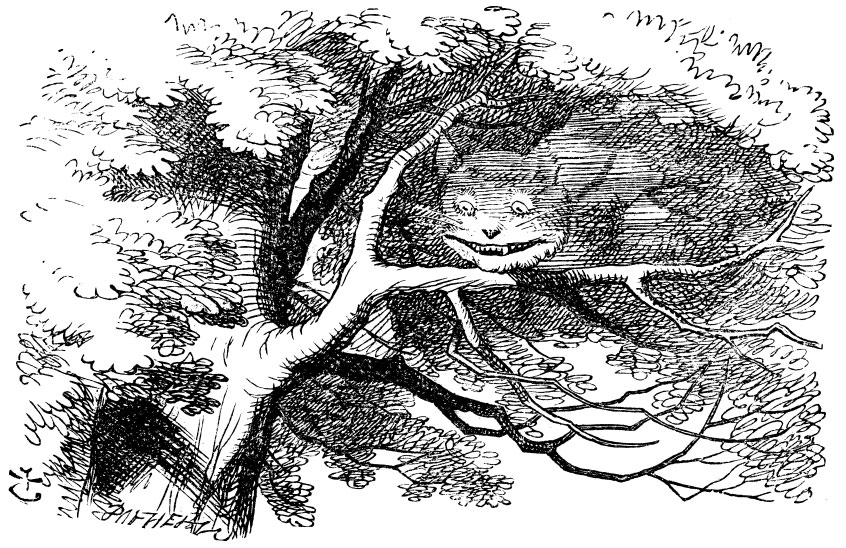

import { LinkButton, CardGrid, LinkCard } from '@astrojs/starlight/components';
import CopyPromptButton from '../../components/CopyPromptButton.astro';

The Cheshire Cat is an open-source, hackable framework - the best way to learn and experiment with AI agents.

It is designed bottom up to be **easy to understand** and **easy to extend** via vibe coding and agentic engineering.

If you are curious and creative, you are in the right place.

  <LinkButton href="/docs/quickstart/installation-configuration/">Get started now</LinkButton>
  <CopyPromptButton />

## Quick links

<CardGrid>
  <LinkCard title="Get started" description="Install the Cat and run it in minutes." href="/docs/quickstart/installation-configuration/" />
  <LinkCard title="Create an Agent" description="Build your own agent: a loop, tools and a prompt." href="/docs/plugins/agents/" />
  <LinkCard title="Create a Plugin" description="Extend the Cat with your own Python." href="/docs/plugins/plugins/" />
  <LinkCard title="Hooks" description="Hook into the Cat's flow and reshape its behavior." href="/docs/plugins/hooks/" />
</CardGrid>

## Why the Cat

 - learn how AI agents work, bottom up
 - easy to understand, easy to extend
 - built for vibe coding and agentic engineering
 - here since 2023

## License

Code is licensed under [GPL3](https://raw.githubusercontent.com/cheshire-cat-ai/core/main/LICENSE).  
Name and trademark are property of [Piero Savastano](https://pieroit.org), founder and maintainer.

## Are you lost?

Professional training, support and customization [available](https://cheshirecat.ai/services).

    "Would you tell me, please, which way I ought to go from here?"
    "That depends a good deal on where you want to get to," said the Cat.
    "I don't much care where--" said Alice.
    "Then it doesn't matter which way you go," said the Cat.

    (Alice's Adventures in Wonderland - Lewis Carroll)
