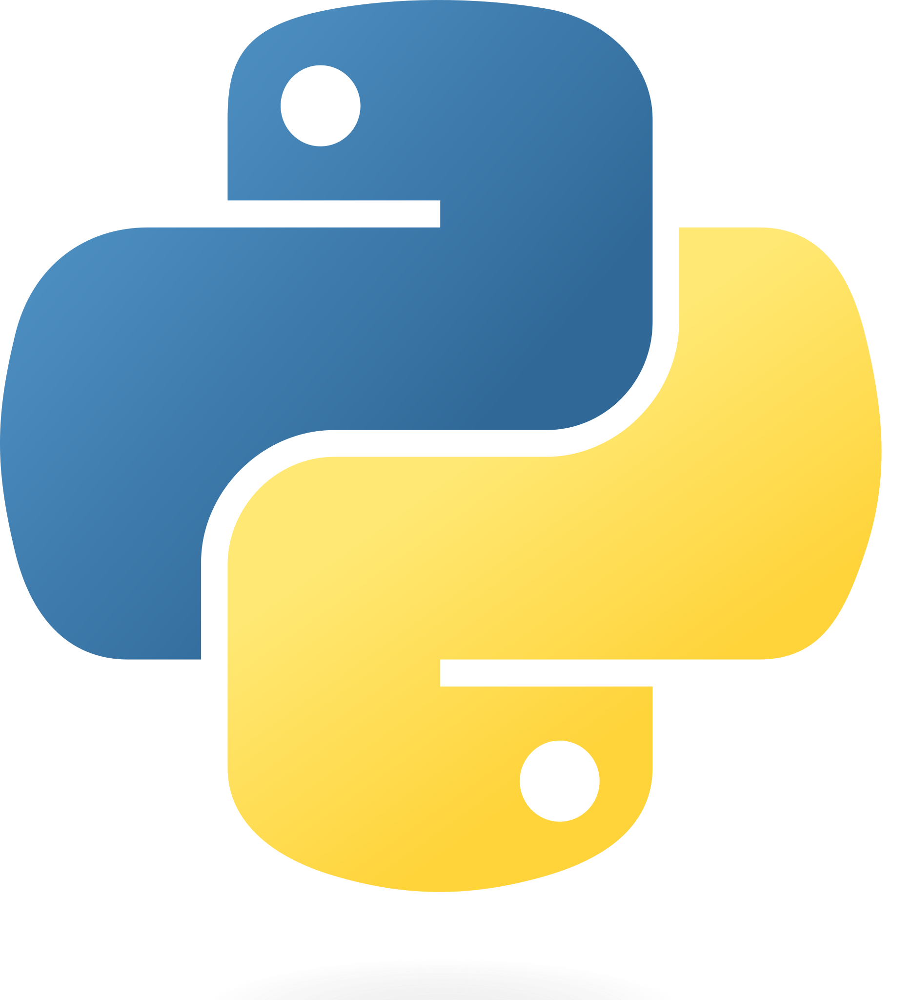
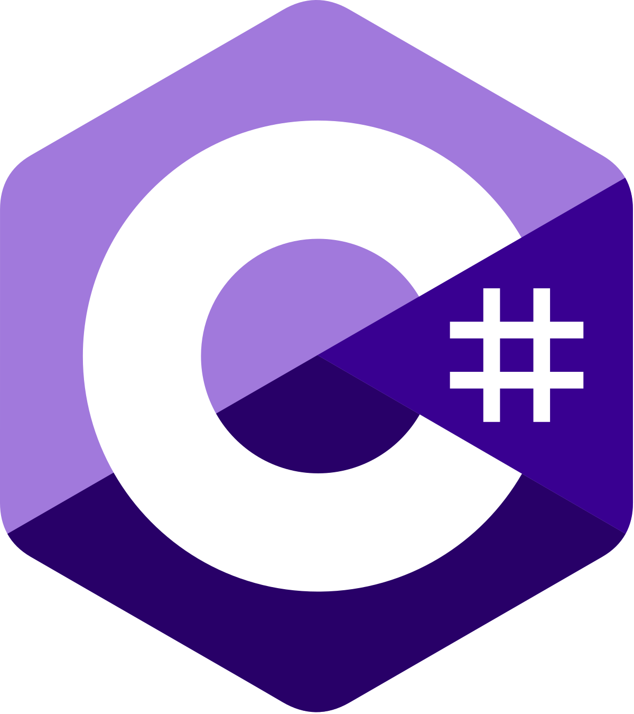
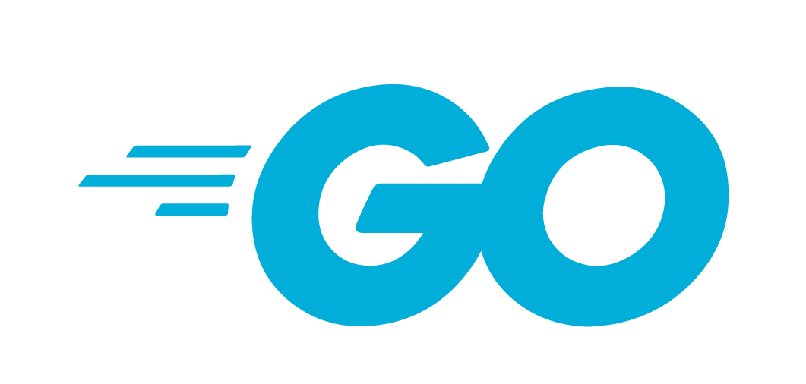
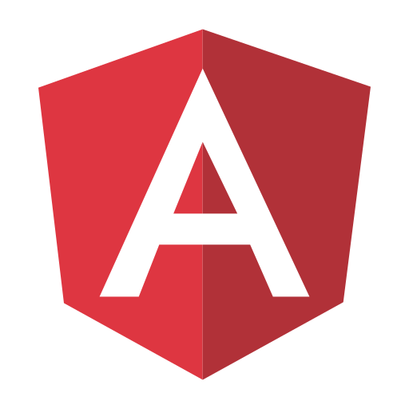

How do you talk with the Cat from a script, from the browser or from a server?  
The Cat is an AI microservice, which means it is intended to be added to any application as a conversational layer.

You can check out the REST API playground directly on your installation, at [`localhost:1865/docs`](http://localhost:1865/docs).

There are several client libraries that may help you to easily chat with the Cat and call its endpoints from another application.
Below we list client libraries in many languages, web widgets and client apps.

Some of the clients are maintained from the community, some others come from individual contributors. If you find any problem, open an issue or PR on the dedicated repository - be nice!

## Client Libraries

| Language                                                                                | Repository                                                                                         |
| :-------------------------------------------------------------------------------------: | :------------------------------------------------------------------------------------------------: |
|  | [Typescript/Javascript Client](https://github.com/cheshire-cat-ai/api-client-ts) |
|   | [Python Client](https://github.com/cheshire-cat-ai/api-client-py)                |
|         | [C# Client](https://github.com/cheshire-cat-ai/api-client-csharp)                |
|              | [PHP Client](https://github.com/AlboCode/ccatphp-sdk)                            |
|             | [Ruby Client](https://github.com/Jhonnyr97/cheshire_cat_api)                     |
|                     | [Go Client](https://github.com/saniales/ccat-api)                                |
|                   | [Java Client](https://github.com/matteobaccan/cheshire-cat-api-client-java)      |

## Frontend Chat Widgets

| Framework                                                               | Repository                                                                                          |
| :---------------------------------------------------------------------: | :-------------------------------------------------------------------------------------------------: |
|      | [Vue Widget](https://github.com/cheshire-cat-ai/widget-vue)                       |
|   | [Alpine Widget](https://github.com/cheshire-cat-ai/widget-alpine)                 |
|   | [Svelte Widget](https://github.com/cheshire-cat-ai/widget-svelte)                 |
|    |  [React + TS Widget](https://github.com/matteo-brandolino/widget-ccat-react-ts)   |
|    | [React Widget](https://github.com/AndreaPesce2002/widget-CCAT-react)              |
|  | [Angular Widget](https://github.com/Edoardo-Croci-CLDev/ccat-chat-widget-angular) |

## Apps & Integrations

| Platform                                                                          | Repository                                                                         |
| :-------------------------------------------------------------------------------: | :--------------------------------------------------------------------------------: |
|  | [Telegram bot](https://github.com/Pingdred/Meowgram)             |
|               | [Discord bot](https://github.com/cheshire-cat-ai/discord-bot-ts) |
|                           | [Nginx compose](https://github.com/mimir-chatbot/reverse-proxy-example) [Nginx compose with SSL](https://github.com/vancif/cheshire-cat-nginx-proxy) |
|                            | [Tipi App](https://runtipi.io/docs/apps-available)                |
|               | [Laravel SDK](https://github.com/webgrafia/cheshire-cat-sdk-laravel) |
|             | [WordPress plugin](https://github.com/webgrafia/cheshire-cat-wp) | 
|               | [Flutter-Cat](https://github.com/pignatiello/fluttercat.git) |

## Command Line Interfaces

| Language                                                             | Repository                                                         |
| :-------------------------------------------------------------------:| :----------------------------------------------------------------: |
|  | [Meow CLI](https://github.com/saniales/meow)     |
|  | [Cheshire Cat CLI](https://github.com/rmoscetti/cheshire-cat-ai-tools)    |