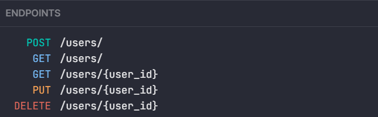
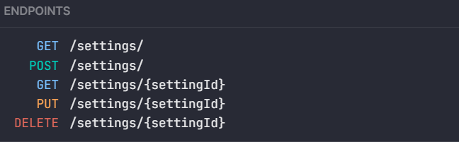
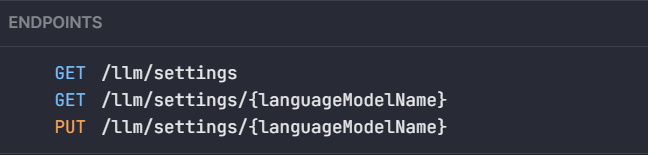

You can play around with the HTTP endpoints directly on your installation, under [`localhost:1865/docs`](http://localhost:1865/docs).
You will find there most of the documentation you need, alongside code snippets in various languages and a useful playground to try them out.  

## Examples

When you feel ready you can also create [custom endpoints](/docs/plugins/endpoints/) direclty in your plugins.

