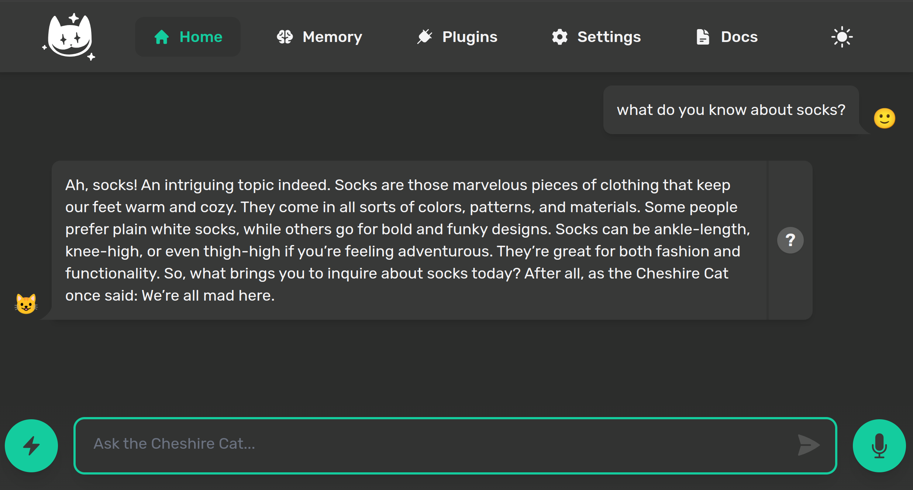

import { Tabs, TabItem } from '@astrojs/starlight/components';

The Cat is an **API-first** framework, it is intended to be used machine to machine. Anything can be done via endpoints, so you can easily add a web UI or a mobile app on top.

## Web UI

A minimal web UI is included in plugin `ui`, automatically installed at first launch. Find it at [http://localhost:1865](http://localhost:1865).  
The UI also allows you to manage settings and plugins. 



## REST API

To talk to the Cat from another application, send a `POST` request to:

```http
POST /agents/{slug}/message
```

- `{slug}` is the id of the agent you want to talk to. Every fresh install ships a built-in agent with slug `default`, so use `default` if you have not written your own agent yet. You can list every registered agent at [http://localhost:1865/agents](http://localhost:1865/agents).
- Authentication is a single header: `Authorization: meow`. `meow` is the default master key for local development. Change it before going to production (see [Authentication](/docs/production/auth/authentication/)).
- The body carries the conversation as a list of `messages`, composed of one or more `ContentBlock`.

Here is how to call the endpoint from Python and JavaScript:

<Tabs>
  <TabItem label="Python">

```python
import requests

response = requests.post(
    "http://localhost:1865/agents/default/message",
    headers={"Authorization": "meow"},
    json={
        "messages": [
            {
                "role": "user",
                "content": [
                    {
                        "type": "text",
                        "text": "what do you know about socks?",
                    }
                ],
            }
        ],
        "stream": False,
    },
)

reply = response.json()["messages"][-1]["text"]
print(reply)
```

  </TabItem>
  <TabItem label="JavaScript">

```javascript
const response = await fetch("http://localhost:1865/agents/default/message", {
    method: "POST",
    headers: {
        "Authorization": "meow",
        "Content-Type": "application/json",
    },
    body: JSON.stringify({
        messages: [
            {
                role: "user",
                content: [
                    {
                        type: "text",
                        text: "what do you know about socks?",
                    }
                ],
            }
        ],
        stream: false,
    }),
})

const data = await response.json()
const reply = data.messages.at(-1).text
console.log(reply)
```

  </TabItem>
</Tabs>

If you activate the `stream` flag, you will receive a stream of [AGUI events](https://docs.ag-ui.com/concepts/events).
